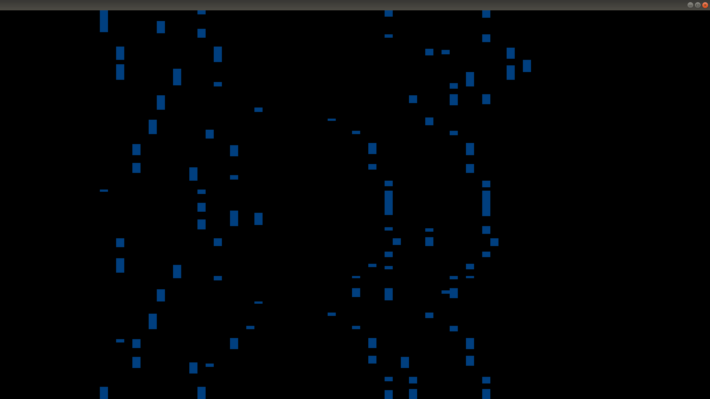

# realtime midi visualizer

openframeworksを使って, 電子ピアノなどによるMIDI入力をリアルタイムで可視化するアプリです. [Synthesia](https://synthesiagame.com)を参考にしています. ちょっと演出を豪華にしたり, 面白くできたらいいなと考え中.

# 動作の様子

# 動作環境
openframeworks 0.11.0